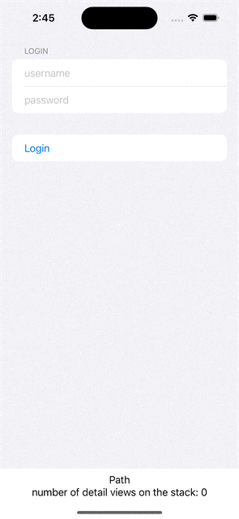
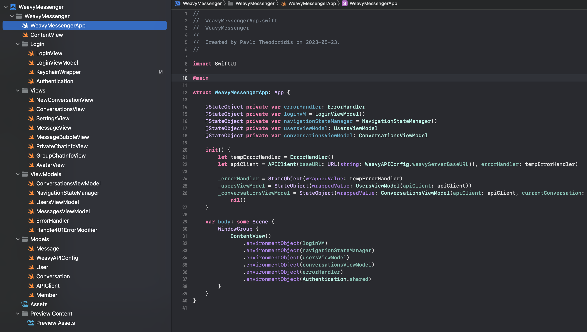

# WeavyMessenger

This project showcases the messenger app I built for web development company Weavy.
I built the app based on Weavys own API and backend using Swift's MVVM structure.

It features:
• API and backend integration
• JSON parsing
• Navigation Stack

Demo GIF:

Image example of MVVM file structure:

